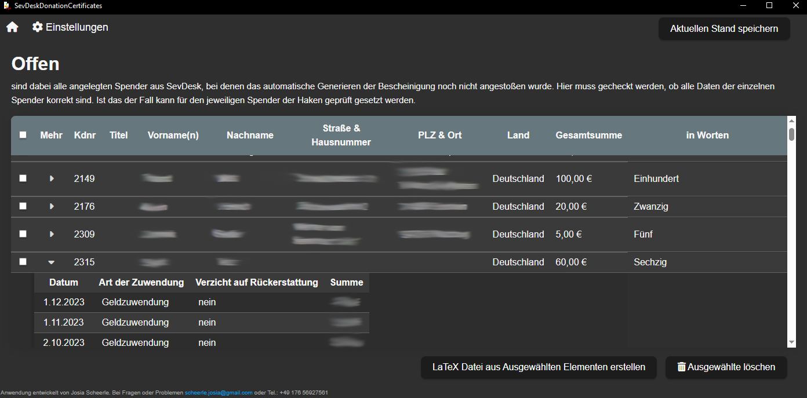

# SevDesk-Extension Spendenbescheinigung

Ein Tool um automatisch Spendenbescheinigungen zu Generieren. Dazu werden Daten von der [SevDesk-API](https://api.sevdesk.de/) verarbeitet um Sammelbriefe für alle Spender zu erstellen.

## Simple structure

Standardmäßig werden innerhalb von einem Gerät Befehlen auf dem Localhost mit Port 8040 gesendet. Sollte dieser belegt oder aus anderen Gründen nicht benuztbar sein bitte melden.

### Backend

Es gibt einen Server im Hintergrund. Er handhabt die gesamte Datenstruktur und erstellt die Spendenbescheinugungen. Diese werden am Schluss als Lua-LaTeX (.tex) Datei ausgegeben.

### Frontend

Zur Benutzerfreundlichen Bedienung gibt es eine Graphische Oberfläche, die auf dem [Tauri-Framework](https://tauri.app/) basiert und alle wichtigen Funktionen bereitstellt.

Mehr zum Frontend [Hier](https://github.com/ScheerleJo/SevDeskClient)

## Installations Prozess

Das Tool besteht aus 2 Bestandteilen: dem Client und dem Server

### Aufsetzen des Node.JS Servers

Da der Webserver, welcher im Hintergrund läuft noch ein Work in Progress ist, ist die Installation nicht ganz so trivial.

1. Zunächst muss Node.JS installiert werden. Hier der Download-Link für die Aktuelle Version: [20.10.0](https://nodejs.org/dist/v20.10.0/node-v20.10.0-x64.msi) Es ist sinnvoll die Zusätzlichen Pakete wie C/C++ in diesem Installationsprozess mit zu installieren.

2. Wenn die Installation erfolgreich war kann als nächstes das aktuelle [Release](https://github.com/ScheerleJo/SevDeskServer/releases) von SevDesk-Server heruntergeladen werden. Dazu am besten vom `Latest`-Release das zip-Verzeichnis runterladen.

3. Das Zip-Verzeichnis wird nun am Speicherort der Wahl entpackt.
4. In dem dem Ordner `SevDeskServer-*Version*` muss nun die Konsole geöffnet werden. Das funktioniert in Windows mit gedrückter Shift-Taste und einen Rechtsklick auf den Ordner. In dem erweiterten Menü kann man nun `Eingabeaufforderung hier öffnen` auswählen. Diese öffnet sich anschließend.
5. Wenn die Konsole geöffnet ist, muss folgender Befehl eingegeben werden, um alle Abhängikeiten herunterzuladen:

    ``` PowerShell
    > npm install
    ```

6. Nun kann der Server ausgeführt werden. Dazu einfach auf den folgenden Befehl in die Konsole eingeben:

    ``` PowerShell
    > npm run start
    ```

Anschließend zeigt die Konsole Text an, dass der Server auf Port 8040 läuft.

WICHTIG: Diese Konsole darf während der Laufzeit **NICHT** geschlossen werden. Minimieren ist in Ordnung. Wenn sie geschlossen wird ohne über die Benutzeroberfläche zu speichern, ist der Fortschritt verloren und es muss von vorne begonnen werden.

### Benutzeroberfläche installieren

Da es nicht besonders schön und praktisch ist eine Konsole zu bedienen, gibt es für diese Anwendung eine Benutzeroberfläche.
Diese ist deutlich leichter zu installieren.
Dazu muss lediglich der Installer aus dem Aktuellen [Release](https://github.com/ScheerleJo/SevDeskClient/releases) heruntergeladen werden. Dieser führt anschließend durch den gesamten Installationsprozess.

WICHTIG: Um das Tool sauber nutzen zu können muss der Server laufen, **BEVOR** die Benutzeroberfläche gestartet wird.

## Grundlegende Funktionen

### API-Schlüssel

Zunächst muss der API-Schlüssen von SevDesk generiert werden. Dieser kann anschließend im GUI eingefügt und gespeichert werden. Dazu auf `Einstellungen > Authorisierungs-Token`
Hier kann der Schlüssel eingegeben werden.

Dieser Prozess muss nur beim ersten einrichten gemacht werden.

### Die Ersten Daten von SevDesk

Anschließend kann das Jahr ausgewählt werden für das die Spendenbescheinigungen erstellt werden sollen. Danach auf `Daten neu von SevDesk holen` klicken. Nun werden alle Daten importiert.
Diese Funktion kann einige Sekunden dauern.
Wenn alle Daten angekommen sind wird automatisch das Fenster gewechselt zu einer Ansicht in der man alle Spender aus dem ausgewählten Jahr sieht.

Hier stehen (hoffentlich) alle relevanten Daten, um mögliche Fehler zu finden und diese zu beheben.

### Überblick

Es gibt effektiv 2 unterschiedliche Fenster zwischen denen hin und her gewechselt werden kann. Das erste ist die Start-Ansicht. Hier ist das aktuell zu bearbeitende Jahr sichtbar, sowie der Fortschritt. Ein Klick auf das Haus im oberen Linken Eck führt direkt zur Startseite zurück.


Wenn die Daten neu importiert werden beginnt jeder Datensatz bei Offen. Ein Klick in der Tabelle auf die Spalte "Offen" zeigt die untenstehende beispielhafte Liste. Zunächst muss jeder Datensatz geprüft werden, ob Daten stimmen und ob die Spender vollständig sind (also voller Name, Adresse, usw.)



Einzelne Spenden werden über den kleinen Pfeil in der Spalte "Mehr" sichtbar. Ein erneuter Klick lässt diese wieder verschwinden.

Bei jedem Spender der geprüft ist, kann das Kästchen in der ersten Spalte für den jeweiligen Spender angeklickt werden. Wenn alle auf einmal ausgewählt werden sollen, kann das Kästchen in der blauen Zeile angeklickt werden.

Wenn nun die Daten geprüft und ausgewählt sind kann auf den Knopf `LaTeX datei aus ausgewählten Elementen erstellen` geklickt werden. Diese Elemente verschwinden aus der aktuell angezeigten Tabelle und werden in den nächsten Status verschoben.

Die LaTeX Datei wurde erstellt und befindet sich im Downloads-Ordner.

Diese kann nun in Overleaf importiert werden und zu einem PDF kompiliert werden.

Nun oder nach dem Ausdrucken können erneut die Daten aus der Tabelle im Status `Prüfen` gecheckt werden, ob alles passt. Ist das der Fall, kann das kästchen für den Spender erneut angeklickt werden und auf "Ausgewählte Geprüft" geklickt werden. Für diese Spender ist der Prozess nun abgeschlossen.

Sollten sich Fehler in den Daten befinden, müssen diese über SevDesk korrigiert und dann erneut, wie oben beschrieben neu Importiert werden. dazu können die einzelnen Spender ausgewählt und gelöscht werden.

**WICHTIG** Das löscht nicht die Daten in SevDesk sondern nur in diesem Tool. Die Daten können immer wieder neu aus SevDesk importiert werden.

Aktuell werden dabei alle Elemente überschrieben egal, was für einen Status sie bereits erreicht haben. Das kann sich in der Zukunft ändern, sollte das gewünscht sein.

## Latex

Für die Latex-Dokument-Generierung wird eine Vorlage benötigt. Der Pfad zu dieser Datei muss in der `latex_config.json` im Attribut "templatePath" angegeben werden.
Im Aktuellen Stand des Tools werden feste Bindings verwendet um in der Vorlage die Platzhalter bei der Erstellung zu ersetzen. Für spätere Versionen ist geplant, diese über die graphische Oberfläche dynamisch erstellen und verwalten zu können.

Das Schema für die einzelnen Spenden ist ebenfalls in der `latex_config.json` anpassbar. Die Platzhalter werden durch die Begrenzungszeichen `<<` und `>>` beschränkt.

Die aktuellen Platzhalter sind wiefolgt:

Vereins-/Firmendetails:

| Name | Platzhalter | Config-Datei |
| ---- | ----------- | ------------ |
| Straße und Hausnr. | `<<fromstreet>>` | `company.address.street` |
| Stadt | `<<fromcity>>` | `company.address.city` |
| Postleitzahl | `<<fromzipcode>>` | `company.address.zip` |
| Vereinsname | `<<fromname>>` | `company.name` |
| Telefonnummer | `<<fromphone>>` | `company.phone` |
| Email-Adresse | `<<fromemail>>` | `company.email` |
| Website | `<<fromurl>>` | `company.url` |
| Bank Name | `<<frombankname>>` | `company.bank.name` |
| IBAN | `<<fromiban>>` | `company.bank.iban` |
| BIC | `<<frombic>>` | `company.bank.bic` |

Spenderdetails:

| Name | Platzhalter |
| ---- | ----------- |
| Vorname | `<<surename>>` |
| Nachname | `<<familyname>>` |
| Straße und Hausnr. | `<<street>>` |
| PLZ | `<<zip>>` |
| Stadt | `<<city>>` |
| Land | `<<country>>` |
| Gesamtsumme | `<<totalsum>>` |
| In Worten | `<<suminwords>>` |
| Zeitraum | `<<timeframe>>` |
| Spenden | `<<donations>>` |

## Fehlerbehebung

Sollten Fehler auftreten ist in der Benuteroberfläche die Email-Adresse und eine Telefonnummer zu finden. Bei Fragen am besten per WhatsApp oder Mail. Bei ganz dringenden Fällen anrufen.

Bei Wünschen zur Erweiterung oder veränderung von Funktionen oder Aussehen gerne auch per Mail oder über ein [Issue](https://github.com/ScheerleJo/SevDeskServer/issues) auf Github.

## Developer

 | [`@ScheerleJo`](https://github.com/ScheerleJo)